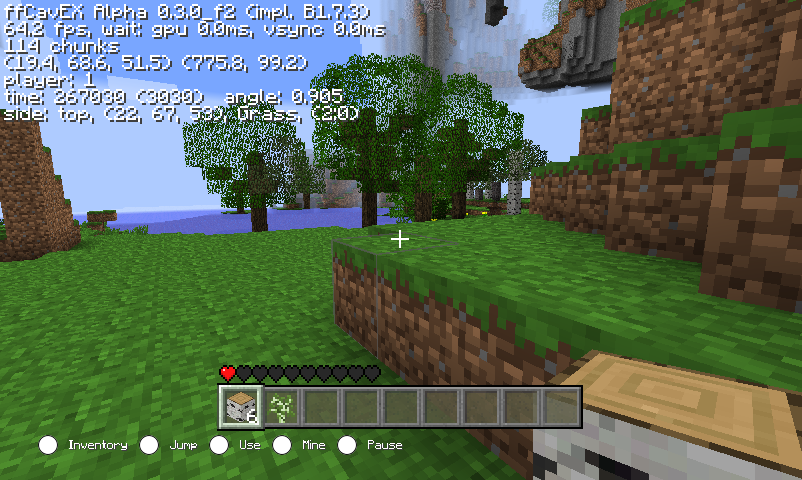
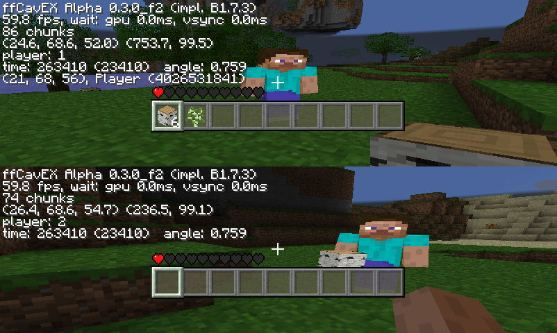
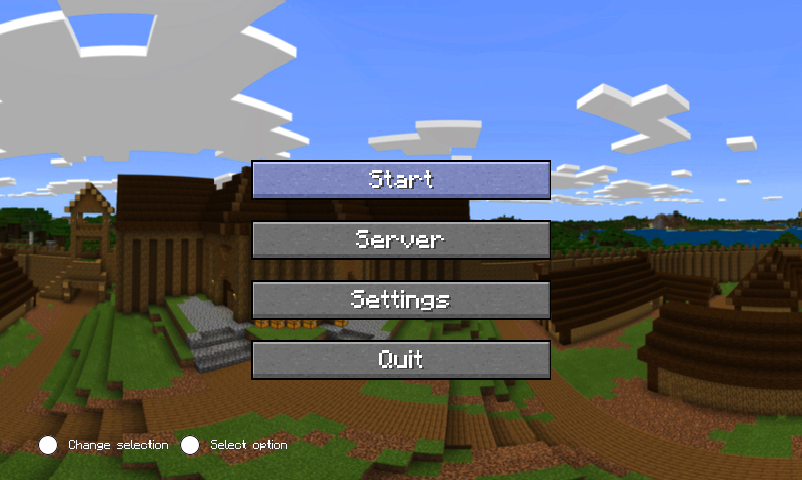

# CavEX

[Cave Explorer](https://github.com/xtreme8000/CavEX) by [xtreme8000](https://github.com/xtreme8000) is a Wii homebrew and PC game with the goal to recreate most of the core survival aspects up until Beta 1.7.3. 

*CavEX* is a fork of [fCavEX](https://github.com/jilleb/fCavEX), made by [jilleb](https://avatars.githubusercontent.com/u/8352494?v=4&size=40), with all kinds of changes and additions. Some additions may not be from the original game and some mechanics may be different - this fork is not aiming for a 1:1 recreation. Unlike CavEX, fCavEX does not aim for complete save compatibility - for instance, chests and signs use an incompatible saving system with static limits and some blocks may use metadata values differently. Until stated otherwise, a freshly created save should be compatible, as fCavEX does not have its own world generator yet.

**Changes, compared to jilleb's fCavEX**

* Redstone functionality with bug's but it looks like redstone now.
* Added Sheeps and Pigs and fix the crash with autojump
* Added Splitscreen and Multiplayer (in the pc inputs you can change in the config_pc.json or when you install the game in ~/usr/local/bin/Cavex/input_pc.json)
* Added a main menu
* Added a controller menu like in Mario Kart Wii
* Added sound in the menu
* Fixed Minecart bug

---

**Planned features** *(in no particular order, not complete)*
* Sounds in the game
* Block gravity: sand and gravel drop down when there's nothing underneath them to support
* Water/lava flow: once a brick has been removed next to, or underneath a liquid, it will flow there
* Additional controller support
* Mobs
* Fixes to existing bugs:
	- Furnace has 4 identical sides

 	- leaves stay floatingin the air after log has been removed

**Known issues**

* Texture orientation for blocks that have a specific "direction"
	- Bed placement isn't correct yet
	
* Random crashes, once in a while.. Maybe I'll implement an optional auto-save, to prevent some headaches and tears

* Particles already spark fire before the torch is showing, after placing a torch

* Probably more, but don't be a hater please.

  

## License

This project is licensed under the GNU General Public License v3.0 (GPLv3).  
See the `LICENSE` file for full details.


## Screenshots







*(from the PC version)*

There should then be a boot.dol file in the ready-wii directory that your Wii can run. To copy the game to your `apps/` folder, it needs to look like this:
```
cavex
├── assets
│   ├── terrain.png
│   ├── particles.png
│   └── ...
├── saves
│   ├── world
│   └── ...
├── boot.dol
├── config_wii.json
├── icon.png
└── meta.xml

```


## Build

__Wii:__

```bash
make wii -j$nropt IS_PC_BUILD=0
```


__PC:__

```bash
make pc IS_PC_BUILD=1
```

or if you want to install:
```bash
sudo make pc-install IS_PC_BUILD=1
```

run:

if installed:

```bash
cavex
```

