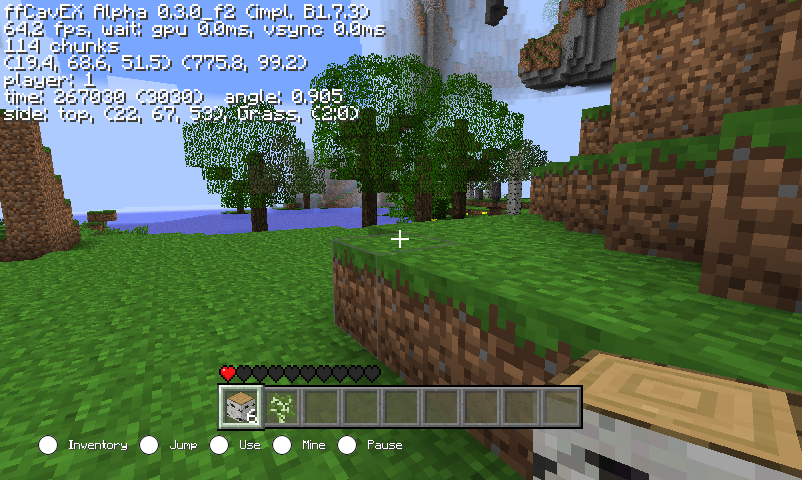
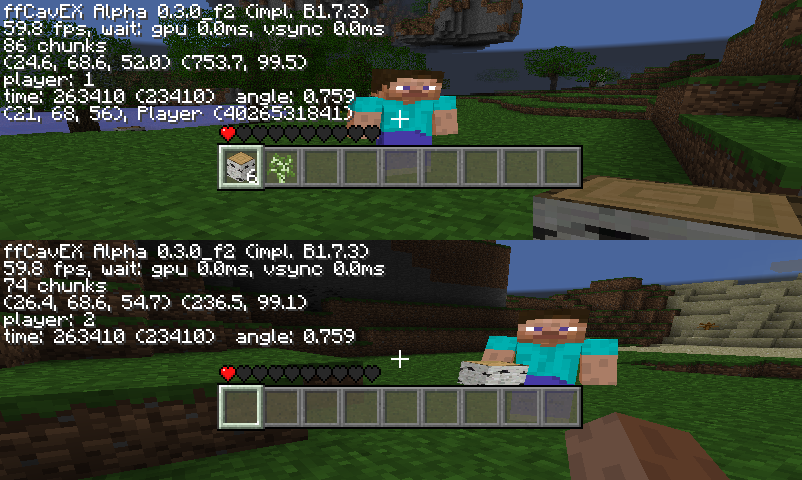
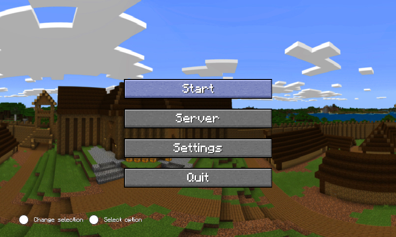

# CavEX

[Cave Explorer](https://github.com/xtreme8000/CavEX) by [xtreme8000](https://github.com/xtreme8000) is a Wii homebrew and PC game with the goal to recreate most of the core survival aspects up until Beta 1.7.3. 

*CavEX* is a fork of [fCavEX](https://github.com/jilleb/fCavEX), by [jilleb](https://github.com/jilleb), with all kinds of changes and additions. Some additions may not be from the original game and some mechanics may be different - this fork is not aiming for a 1:1 recreation. Unlike the original CavEX, this CavEX does not aim for complete save compatibility - for instance, chests and signs use an incompatible saving system with static limits and some blocks may use metadata values differently. You can copy original Minecraft worlds into the saves folder and play them, but the world generator might not generate new terrain that matches the original world.


### Changes, compared to jilleb's fCavEX

* Added basic Redstone functionality (visuals are accurate, though bugs remain).

* Added sheep and pigs and fixed a crash related to the auto-jump feature.

* Added local split-screen and multiplayer support

  (in the PC version, you can change the inputs in config_pc.json or, if installed, in /usr/local/bin/Cavex/input_pc.json)

* Added a main menu with audio.

* Added a controller menu like in Mario Kart Wii

* Added a random world generator

* Added a server menu that executes Python scripts directly from the server.

* Added Creative mode (Based on the Code of [amahpour](https://github.com/amahpour/CavEX))

---


### Planned features <span style="font-size: 16px; font-weight: normal;">*(in no particular order, not complete)*</span>

* Sounds in the game
* Server multiplayer
* Block gravity: sand and gravel drop down when there's nothing underneath them to support
* ~~Water/~~lava flow: once a block has been removed next to, or underneath a liquid, it will flow there
* Nether 
* Sneaking mechanic (A button on Wii / Shift on PC)
* Additional controller support
* add more mobs
* Persistent saving for dropped items and entities
* All blocks from [blocks.txt](./blocks.txt)
* General bug fixes

-------------------------------


### Known issues

* Texture orientation for blocks that have a specific "direction"
	- Bed placement isn't correct yet
* ~~Random crashes, once in a while.~~ Maybe I'll implement an optional auto-save, to prevent some headaches and tears
* ~~Particles already spark fire before the torch is showing, after placing a torch~~
* ~~If you jump into water or climb down the ladder, you take damage~~
* Redstone doesn't really work
* If you jump into a block, you will get stuck and won't be able to move.
* All bugs from [bugs.md](./bugs.md)


## License

This project is licensed under the GNU General Public License v3.0 (GPLv3).  
See the `LICENSE` file for full details.


## Screenshots







*(from the PC version)*


## Build

### Wii

__Install wii-python:__

```bash
cd ~/Downloads
git clone https://github.com/lberwa/wii-cpython.git
cd wii-cpython
make build-host -j$(nproc)
make py -j$(nproc)
sudo make install DEVKITPRO="/PATH/devkitpro" DEVKITPPC="/PATH/devkitpro/devkitPPC"
```
-> see [wii-python](https://github.com/lberwa/wii-cpython) for more information

-------------------

__Build:__


```bash
make wii -j$nropt IS_PC_BUILD=0
```

__clean:__

```bash
make clean IS_PC_BUILD=0
```

------------------------------


### PC:

__first install the libarys:__

```bash
sudo apt install cmake zlib1g-dev libasound2-dev libglfw3-dev libglew-dev
```

----------------

__Build:__

```bash
make pc IS_PC_BUILD=1
```

__... or if you want to install:__
```bash
sudo make pc-install IS_PC_BUILD=1
```

----------

__clean:__

```bash
make pc-clean IS_PC_BUILD=1
```


## Run

### PC:

__If installed:__

```bash
cavex
```

__else:__

```bash
cd buildpc
./cavex
```

------------------


### Wii:

Please wait for the release!
~~you can Download a ready boot.dol from [here](https://example.com/boot.dol) or the full app [here](https://example.com/last_release).~~ To copy the game to your `apps/` folder, it needs to look like this:

```apps/cavex/
cavex
├── assets
│   ├── terrain.png
│   ├── particles.png
│   └── ...
├── saves
│   ├── world
│   └── ...
├── mp32
│   └── ...
├── boot.dol
├── config_wii.json
├── icon.png
├── meta.xml
└── init.py
```


